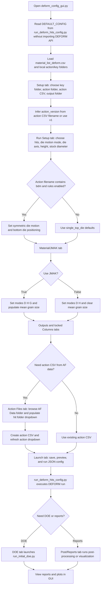

# Flowchart: deform_config_gui.py

```mermaid
flowchart TD
    A["Open deform_config_gui.py"] --> B["Read DEFAULT_CONFIG from run_deform_hits_config.py without importing DEFORM API"]
    B --> C["Load material_list_deform.csv and local action/key folders"]
    C --> D["Setup tab: choose key folder, action folder, action CSV, output folder"]
    D --> D1["Infer action_version from action CSV filename or use v1"]
    D1 --> E["Run Setup tab: choose hits, die motion mode, die axis, height, stock diameter"]
    E --> E1{"Action filename contains bdm and rules enabled?"}
    E1 -->|"Yes"| E2["Set symmetric die motion and bottom die positioning"]
    E1 -->|"No"| E3["Use single_top_die defaults"]
    E2 --> F["Material/JMAK tab"]
    E3 --> F
    F --> F1{"Use JMAK?"}
    F1 -->|"True"| F2["Set modes D H G and populate mean grain size"]
    F1 -->|"False"| F3["Set modes D H and clear mean grain size"]
    F2 --> G["Outputs and locked Columns tabs"]
    F3 --> G
    G --> H{"Need action CSV from AF data?"}
    H -->|"Yes"| I["Action Files tab: browse AF Data folder and populate hit folder dropdown"]
    I --> J["Create action CSV and refresh action dropdown"]
    H -->|"No"| K["Use existing action CSV"]
    J --> L["Launch tab: save, preview, and run JSON config"]
    K --> L
    L --> M["run_deform_hits_config.py executes DEFORM run"]
    M --> N{"Need DOE or reports?"}
    N -->|"DOE"| O["DOE tab launches run_initial_doe.py"]
    N -->|"Reports"| P["Post/Reports tab runs post-processing or visualization"]
    O --> Q["View reports and plots in GUI"]
    P --> Q
```
