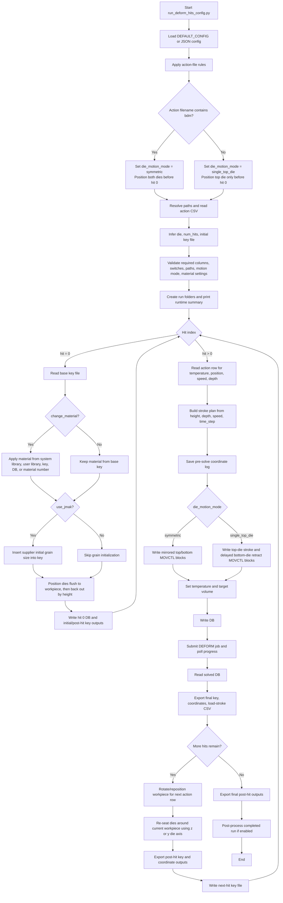

# Flowchart: run_deform_hits_config.py

```mermaid
flowchart TD
    A["Start run_deform_hits_config.py"] --> B["Load DEFAULT_CONFIG or JSON config"]
    B --> C["Apply action-file rules"]
    C --> C1{"Action filename contains bdm?"}
    C1 -->|"Yes"| C2["Set die_motion_mode = symmetric\nPosition both dies before hit 0"]
    C1 -->|"No"| C3["Set die_motion_mode = single_top_die\nPosition top die only before hit 0"]
    C2 --> D["Resolve paths and read action CSV"]
    C3 --> D
    D --> E["Infer die, num_hits, initial key file"]
    E --> F["Validate required columns, switches, paths, motion mode, material settings"]
    F --> G["Create run folders and print runtime summary"]

    G --> H{"Hit index"}
    H -->|"hit = 0"| I["Read base key file"]
    I --> J{"change_material?"}
    J -->|"Yes"| K["Apply material from system library, user library, key, DB, or material number"]
    J -->|"No"| L["Keep material from base key"]
    K --> M{"use_jmak?"}
    L --> M
    M -->|"Yes"| N["Insert supplier initial grain size into key"]
    M -->|"No"| O["Skip grain initialization"]
    N --> P["Position dies flush to workpiece, then back out by height"]
    O --> P
    P --> Q["Write hit 0 DB and initial/post-hit key outputs"]

    H -->|"hit > 0"| R["Read action row for temperature, position, speed, depth"]
    R --> S["Build stroke plan from height, depth, speed, time_step"]
    S --> T["Save pre-solve coordinate log"]
    T --> U{"die_motion_mode"}
    U -->|"symmetric"| V["Write mirrored top/bottom MOVCTL blocks"]
    U -->|"single_top_die"| W["Write top-die stroke and delayed bottom-die retract MOVCTL blocks"]
    V --> X["Set temperature and target volume"]
    W --> X
    X --> Y["Write DB"]
    Y --> Z["Submit DEFORM job and poll progress"]
    Z --> AA["Read solved DB"]
    AA --> AB["Export final key, coordinates, load-stroke CSV"]
    AB --> AC{"More hits remain?"}
    AC -->|"Yes"| AD["Rotate/reposition workpiece for next action row"]
    AD --> AE["Re-seat dies around current workpiece using z or y die axis"]
    AE --> AF["Export post-hit key and coordinate outputs"]
    AF --> AG["Write next-hit key file"]
    AC -->|"No"| AH["Export final post-hit outputs"]
    AH --> AI["Post-process completed run if enabled"]
    AG --> H
    Q --> H
    AI --> AJ["End"]
```
