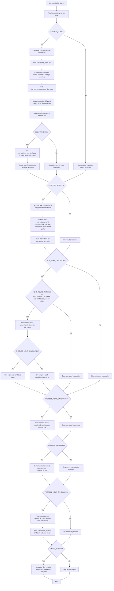

# Flowchart: run_initial_doe.py

```mermaid
flowchart TD
    A["Start run_initial_doe.py"] --> B["Read user settings at top of file"]
    B --> C{"PREPARE_RUNS?"}
    C -->|"Yes"| D["Generate Latin-hypercube candidates"]
    D --> E["Write candidates_initial.csv"]
    E --> F["Create DOE template config from base config + overrides"]
    F --> G["Call doe_runner.orchestrate_doe_runs"]
    G --> H["Create one action CSV and config JSON per candidate"]
    H --> I["Append planned rows to manifest.csv"]
    I --> J{"EXECUTE_RUNS?"}
    J -->|"Yes"| K["Run run_deform_hits_config.py for each generated config"]
    K --> L["Update manifest status to completed or failed"]
    J -->|"No"| M["Stop after dry-run input generation"]
    C -->|"No"| N["Use existing manifest, inputs, and runs"]

    L --> O{"PROCESS_RESULTS?"}
    M --> O
    N --> O
    O -->|"Yes"| P["process_doe_results reads completed manifest rows"]
    P --> Q["Extract initial microstructure, hit microstructure, damage, coordinates, load-stroke paths"]
    Q --> R["Build dataset.csv for completed runs only"]
    O -->|"No"| S["Skip result processing"]

    R --> T{"RUN_NEXT_CANDIDATES?"}
    S --> T
    T -->|"Yes"| U{"NEXT_ROUND_NUMBER <= MAX_ROUND_NUMBER and candidates_next.csv exists?"}
    U -->|"Yes"| V["Create next-round action/config files with doe_runner"]
    V --> W{"EXECUTE_NEXT_CANDIDATES?"}
    W -->|"Yes"| X["Run proposed-candidate batch"]
    W -->|"No"| Y["Dry-run proposed-candidate batch only"]
    U -->|"No"| Z["Skip next-round preparation"]
    T -->|"No"| AA["Skip next-round preparation"]

    X --> AB{"PROCESS_NEXT_CANDIDATES?"}
    Y --> AB
    Z --> AB
    AA --> AB
    AB -->|"Yes"| AC["Process next-round completed runs into next dataset.csv"]
    AB -->|"No"| AD["Skip next-round processing"]

    AC --> AE{"COMBINE_DATASETS?"}
    AD --> AE
    AE -->|"Yes"| AF["Combine initial and next datasets into dataset_all.csv"]
    AE -->|"No"| AG["Keep per-round datasets separate"]

    AF --> AH{"PROPOSE_NEXT_CANDIDATES?"}
    AG --> AH
    AH -->|"Yes"| AI["Train surrogate on dataset_all.csv if present, else dataset.csv"]
    AI --> AJ["Write candidates_next.csv and surrogate_report.json"]
    AH -->|"No"| AK["Skip Bayesian proposal"]

    AJ --> AL{"MAKE_REPORT?"}
    AK --> AL
    AL -->|"Yes"| AM["visualize_doe_results writes report/index.html and plots"]
    AL -->|"No"| AN["Skip report refresh"]
    AM --> AO["End"]
    AN --> AO
```
